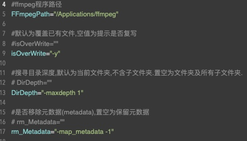

# ffmpegBatchConvert
 ffmpeg批量转换批处理命令
 
#用于在macOS系统下调用ffmpeg工具批量转换音视频文件.
#如批量将某目录下所有avi文件转为mp4格式.
#如批量将某目录下所有flac文件转为mp3格式.

#可选项
* 可指定转换的文件夹.
* 可指定输入文件后缀.
* 可指定输出文件后缀.
*可设置检索是否遍历子目录.
* 可设置是否覆写输出文件.
* 可移除文件中的metadata标签.

#双击运行提示无权限
* 需要为文件添加可执行权限.
* chmod +x fbc.command

#需要下载ffmpeg程序放置于应用目录下
*下载地址:[https://ffmpeg.org/download.html#build-mac](https://ffmpeg.org/download.html#build-mac)

#使用说明
*文本编辑器打开fbc.command
*根据需要按注释设定(ffmpeg路径/是否覆写/是否遍历子目录/是否移除元数据)变量默认值.

*双击或拖入终端执行fbc.command.
*输入音视频所在目录(按住option并在文件目录上右键使用复制pathName命令)回车.

*输入要转换的源文件后缀,默认为flac.回车.

*输入要转换输出的格式后缀,默认为wav.回车.
*等待转换完成.
*在源目录下可找到转换后的文件.
